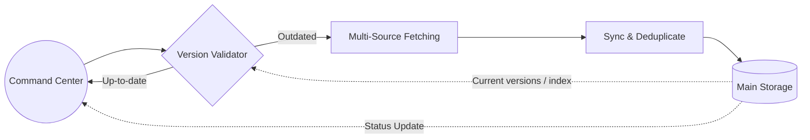
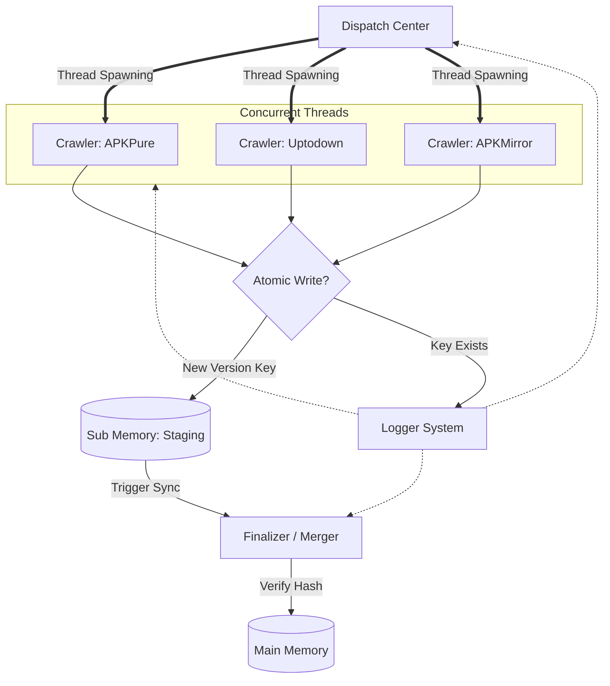
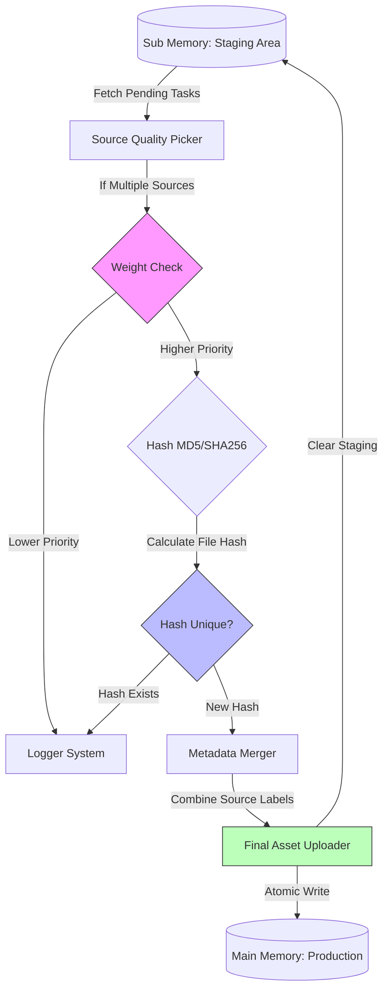
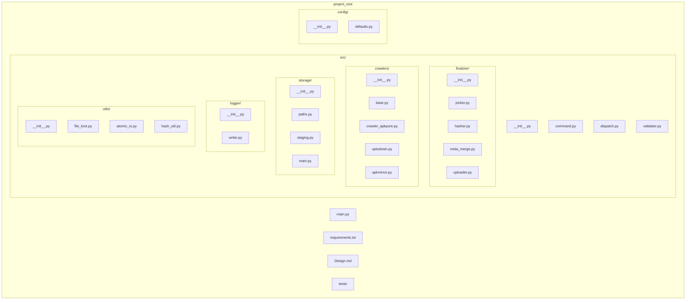

# Project Design
Background:
Acquiring a large number of APKs is not easy for a single person. Consider using a crawler to simplify the process

## Target
- Fetch latest APKs on famous website like: apkpure, uptodown and apkmirror
- Build a modern system, using sub service for control each model.(model is a unit for each part of crawler) **Deployment: single process, multi-thread; each crawler runs as a thread under Dispatch Center.**
- Support incremental update on APKs
- An independent logger system for backtracing if error occured
- **Storage: file-system only** — no database; Main Storage and Staging are implemented as directories and JSON index files (single-machine, easy deployment and backup).

## System Design
---
<b>Top Layer</b>

- **Version Validator** baseline: reads current app+version list from Main Storage (file-system index, e.g. `main/index.json`); compares with each source’s discovered version list and triggers Fetch only for missing or newer versions (incremental).
- **Sync & Deduplicate**: implemented by Finalizer (Staging → Main); Fetch writes to Staging (file-system), then Finalizer merges and deduplicates into Main Storage.
---
<b>Dispatch Center and Memory design</b>

- **Finalizer trigger**: e.g. when Staging pending count ≥ N, or every T minutes (to be chosen at implementation).
- **Error handling**: failed Fetch or Finalizer steps can be retried (e.g. re-queue to Staging or a dead-letter queue); Logger records failures for backtracing.
- **Conflict / Key Exists**: “Key Exists” = this app+version already in Main Storage → skip write, log. Staging may hold multiple records per app+version from different sources; Finalizer’s Source Quality Picker chooses one by weight.
---
<b>Thread pool and graceful shutdown</b>

To protect the file system and keep the process controllable, the Dispatch Center uses a **global thread pool** as its core. Without a cap, e.g. 100 APKs to update × 3 sources would create 300 concurrent threads: file handles can be exhausted, disk I/O can block, and concurrent writes to `staging/index.json` (or similar metadata) can conflict. A single process-wide pool with a fixed **max_workers** (e.g. 3, configurable) ensures that only that many tasks run at any time; all crawl work is submitted as tasks to this pool, not by spawning unbounded threads.

- **Task-level isolation**: Each task is one crawl unit (e.g. one source + one app/version). If one task blocks (e.g. APKPure stuck due to anti-crawl), other tasks (Uptodown, APKMirror) continue; the pool isolates failure to a task and does not block the whole process.
- **Graceful shutdown**: Because storage is file-system–based, abrupt exit (e.g. Ctrl+C) can leave half-written or partially downloaded files. The pool (or dispatch cooperating with a signal handler) must handle SIGINT/SIGTERM by: requesting shutdown, waiting for in-flight tasks to complete or be cancelled, cleaning up partial files (e.g. delete incomplete APKs, leave index consistent), then exiting. This keeps the file system in a consistent state and avoids leftover garbage files.
- **Config**: `max_workers` (and optionally shutdown timeout) are centralized in config (e.g. `config/defaults.py`) so the whole application respects one concurrency limit.
---
<b>File-system storage layout</b>
- **Root**: configurable storage root (e.g. `./data`). All paths below are relative to it.
- **Staging (Sub Memory)**: `staging/index.json` (pending app+version list with source, path, meta) and `staging/apks/` (downloaded APK files). Crawlers append to the index and write APKs; Finalizer reads, merges, then clears only successfully merged keys from Staging.
- **Main (Production)**: `main/index.json` (current app+version index for Version Validator baseline) and `main/apks/` (final APK files). Finalizer writes via atomic file operations (e.g. write to temp then rename) and updates the main index.
- **Logs**: `logs/` for Logger output (e.g. by date or run). No database; consistency relies on file locks or single-writer for index files where needed.
- **Config**: Includes storage root, Finalizer trigger N/T, source weights, **thread pool max_workers and shutdown timeout**, and download timeout (e.g. for crawler Playwright expect_download).
---
<b>Finalizer and Merge</b>

- **Clear Staging**: only remove keys that were successfully written to Main (per-key clear after merge); do not wipe the whole Staging to avoid reprocessing or losing pending tasks.

---
## Project Structure

Code layout aligns with the system design

- **Logger**: standalone package under `src/logger/`; writes to `logs/`; used by Command, Dispatch, Crawlers, and Finalizer for backtracing.
- **Utils**: `src/utils/` for shared helpers (file lock, atomic write, hash); no business logic. No central downloader — each crawler implements its own download strategy (e.g. APKPure uses Playwright in-browser download).
- **Storage**: `src/storage/` implements the file-system storage layout (paths, staging index/apks, main index/apks).
- **Entry**: Command Center in `src/command.py`; process entry in `main.py` (load config then call Command).
- **Thread pool**: A **global thread pool** (configurable `max_workers`, e.g. 3) is the core of `src/dispatch.py`. All crawler work is submitted as tasks to this pool so that concurrency is bounded; this protects file handles, disk I/O, and avoids concurrent writes to staging index. Task-level isolation (one task = one source + one app/version) ensures that a stuck crawler (e.g. anti-crawl) does not block others. **Graceful shutdown** on SIGINT/SIGTERM: wait for in-flight tasks to finish or cancel, clean partial files, then exit so the file system is not left with half-written or incomplete downloads.

<b>Directory layout</b>

<b>Design component → code</b>

| Design component | Code location | Role |
|------------------|---------------|------|
| Command Center | `src/command.py` | Call Validator; if outdated run Dispatch then trigger Sync; if up-to-date exit; optional Main status feedback |
| Version Validator | `src/validator.py` | Read main index via storage; compare with each source discovered list; output to_fetch (app+version) |
| Dispatch Center | `src/dispatch.py` | **Global thread pool** (max_workers from config); submit crawl tasks to pool; Conflict/Atomic Write (write Staging or log); trigger Finalizer when condition met; **graceful shutdown** on SIGINT/SIGTERM (wait or cancel in-flight, clean partial files, then exit) |
| Crawlers (APKPure / Uptodown / APKMirror) | `src/crawlers/base.py` + per-source modules | Extend base; implement abstract `fetch()` (discover, download, hash, append to staging); each crawler owns its download strategy (e.g. APKPure: Playwright expect_download + click); use logger |
| Finalizer | `src/finalizer/` | Picker → Hasher → MetaMerge → Uploader; read Staging, write Main, clear Staging by key; use storage.main atomic write |
| Main Storage / Staging | `src/storage/staging.py`, `main.py`, `paths.py` | Implement file-system layout; expose index read/write and APK paths |
| Logger System | `src/logger/` | Standalone; write to logs/; used by Command, Dispatch, Crawlers, Finalizer |
| Utils | `src/utils/` | File lock, atomic write, hash; used by storage, finalizer, crawlers; no central downloader |

<b>Crawler download flow</b>

- **`src/crawlers/base.py`**: Abstract base; defines `resolve_download_url(app_id, version, **kwargs)` and abstract `fetch(app_id, version, **kwargs)`. No shared download implementation — each crawler implements `fetch()` end-to-end.
- **Per-crawler modules** (e.g. `crawler_apkpure.py`): Source-specific discover (category/list pages), resolve app page or download page URL (optional `slug` for direct URL), then perform download and write to staging. APKPure uses **Playwright**: open download page, handle ads/popups, click download button with `expect_download()`, `save_as()` to staging path, compute hash via `hash_file()`, then `staging.append_entry()`. This avoids 403 from direct HTTP and keeps session/cookies in the browser. Config `download.timeout_seconds` is used for Playwright `expect_download` timeout.

<b>High-level dependencies</b>

- **command** → validator, dispatch, storage (read main), logger  
- **dispatch** → crawlers, storage (staging), finalizer, logger, **thread pool** (config: max_workers, shutdown timeout)
- **validator** → storage (main)  
- **crawlers** → storage (staging), logger, utils (lock, hash_util)  
- **finalizer** → storage (staging + main), logger, utils (atomic_io, hash_util)  
- **storage** → utils (file_lock, atomic_io), config (paths)  
- **logger** → config (logs path); no business dependency  
