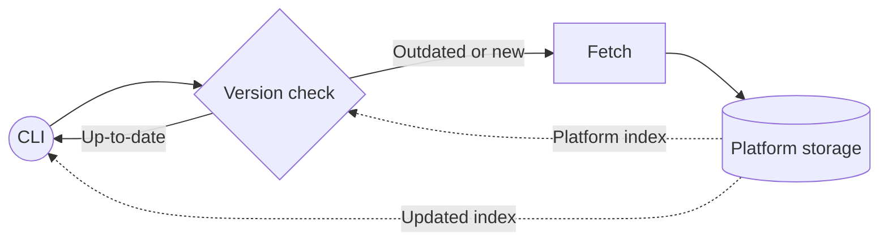
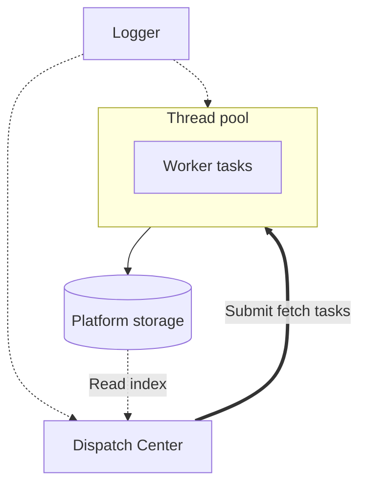
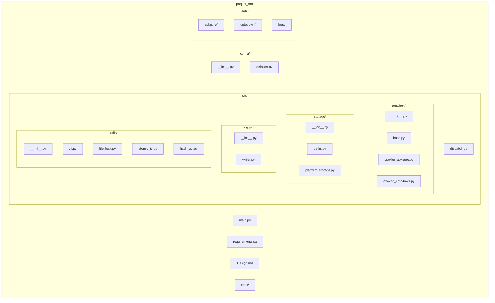

# Project Design

## Background

Acquiring a large number of APKs is not easy for a single person. This project uses crawlers to fetch APKs from APKPure and Uptodown. Each source has its own app_id scheme and package format; storage is per-platform with no cross-source merge.

## Target

- Fetch latest APKs from APKPure and Uptodown.
- Per-platform storage: each source has its own storage directory and index.
- Incremental update per platform: compare the discovered list with that platform’s index and fetch only missing or newer versions.
- Logger: independent logger for backtracing errors; output under a configurable logs directory.
- Storage: file-system only — no database. Each platform uses a directory and JSON index under a configurable root

## System Design

### Top layer (per run)

- **CLI**: parses arguments, selects crawler by `--source`, runs discover / pull / fetch. Uses only the selected platform’s storage and the shared logger.
- **Version check**: reads the current app+version list from this platform’s index. Compares with the discovered list and triggers Fetch only for missing or newer versions.
- **Fetch**: the active crawler downloads APKs and writes directly into its platform’s storage.
- **Platform storage**: one directory per source; each has its own app_id scheme and layout.

### Dispatch Center

- **Single crawler per run**: one process, one crawler. That crawler is the only writer to its platform’s storage.
- **Dispatch Center**: holds a thread pool. Submits fetch tasks for the active crawler so multiple downloads can run in parallel. Does not mix tasks from different crawlers in one run.
- **Graceful shutdown**: on SIGINT/SIGTERM, request shutdown, wait for in-flight tasks to finish or cancel, clean partial files for the active platform, then exit so the file system stays consistent.

### File-system layout

- **Root**: configurable storage root. All paths below are relative to it.
- **Per-platform**: one directory per source.
- **Logs**: Check detail information.
- **Config**: storage root, thread pool `max_workers` and shutdown timeout, download timeout, browser (e.g. headless), and platform-specific options.

## Project structure

- **Entry**: single entrypoint `main.py`. CLI accepts `--source apkpure|uptodown` to choose the crawler. Each run loads config, selects one crawler, and uses that crawler’s platform storage; Dispatch runs fetch tasks for that crawler.
- **Logger**: `src/logger/` — writes to logs/; used by CLI, Dispatch, and Crawlers.
- **Utils**: `src/utils/` — file lock, atomic write, hash, CLI. No central downloader; each crawler implements its own download strategy (e.g. Playwright in-browser download).
- **Storage**: `src/storage/` — per-platform paths (`paths.py`) and platform storage (`platform_storage.py`) for index and APK read/write (by platform key: apkpure, uptodown).
- **Dispatch**: `src/dispatch.py` — thread pool, submit fetch tasks, graceful shutdown, cleanup of partial files for the active platform.
- **Crawlers**: `src/crawlers/base.py` plus per-source modules (`crawler_apkpure.py`, `crawler_uptodown.py`, etc.). Each implements discover (category/list pages) and fetch (download, hash, append to this platform’s index); each has its own app_id and download strategy.

### Directory layout

### Design component → code

| Component        | Location              | Role |
|-----------------|------------------------|------|
| CLI             | `src/utils/cli.py`     | Parse args; `--source` to select crawler; run discover/pull/fetch; use platform storage and logger |
| Version check   | In crawler or CLI     | Read this platform’s index; compare with discovered list; skip if already latest |
| Dispatch Center | `src/dispatch.py`     | Thread pool (max_workers, shutdown timeout); submit fetch tasks; graceful shutdown and cleanup |
| Crawlers        | `src/crawlers/`        | Discover + fetch; write only to this platform’s storage; own app_id and download strategy |
| Platform storage| `src/storage/`        | Per-platform paths and index (e.g. `data/<platform>/index.json`, `data/<platform>/apks/`) |
| Logger          | `src/logger/`         | Write to logs/; used by CLI, Dispatch, Crawlers |

### Crawler flow

- **Base** (`src/crawlers/base.py`): abstract `fetch(app_id, version, **kwargs)` and optional helpers. No shared download implementation.
- **Per-crawler**: discover (source-specific category pages and list logic), resolve download URL (source-specific app_id/slug), download (e.g. Playwright `expect_download`, `save_as` to this platform’s APK path), compute hash, append entry to this platform’s index. Config (download timeout, headless, etc.) from config.

### Dependencies

- **cli** → crawlers, storage (per-platform), dispatch, logger  
- **dispatch** → crawlers, storage (per-platform), logger, thread pool config  
- **crawlers** → storage (own platform), logger, utils (lock, hash_util)  
- **storage** → utils (file_lock, atomic_io), config (paths, platform key)  
- **logger** → config (logs path)
